# Scout Tracker User Guide

**Version 2.0** | Real-time pitch tracking & analytics for youth baseball

---

## Table of Contents

1. [Getting Started](#getting-started)
2. [Data Entry (Game Tracking)](#data-entry-game-tracking)
3. [Coach View (Live Dashboard)](#coach-view-live-dashboard)
4. [Bullpen Tracker](#bullpen-tracker)
5. [Game History](#game-history)
6. [Opponent Scouting](#opponent-scouting)
7. [Pre-Game Reports](#pre-game-reports)
8. [Stats Dashboard](#stats-dashboard)
9. [Team Administration](#team-administration)
10. [Tips & Best Practices](#tips--best-practices)

---

## Getting Started

### What is Scout Tracker?

Scout Tracker is a web-based pitch tracking app designed for youth baseball teams. It allows you to:
- Log pitches in real-time during games
- Monitor pitch counts to protect young arms
- Generate scouting reports on opponents
- View team and individual statistics
- Sync data across multiple devices

### Setting Up Your Team

1. **Open Scout Tracker** at [lamangamatt.github.io/scout-tracker](https://lamangamatt.github.io/scout-tracker/)

2. **Enter Your Team Code** - This is your unique identifier that syncs data across devices

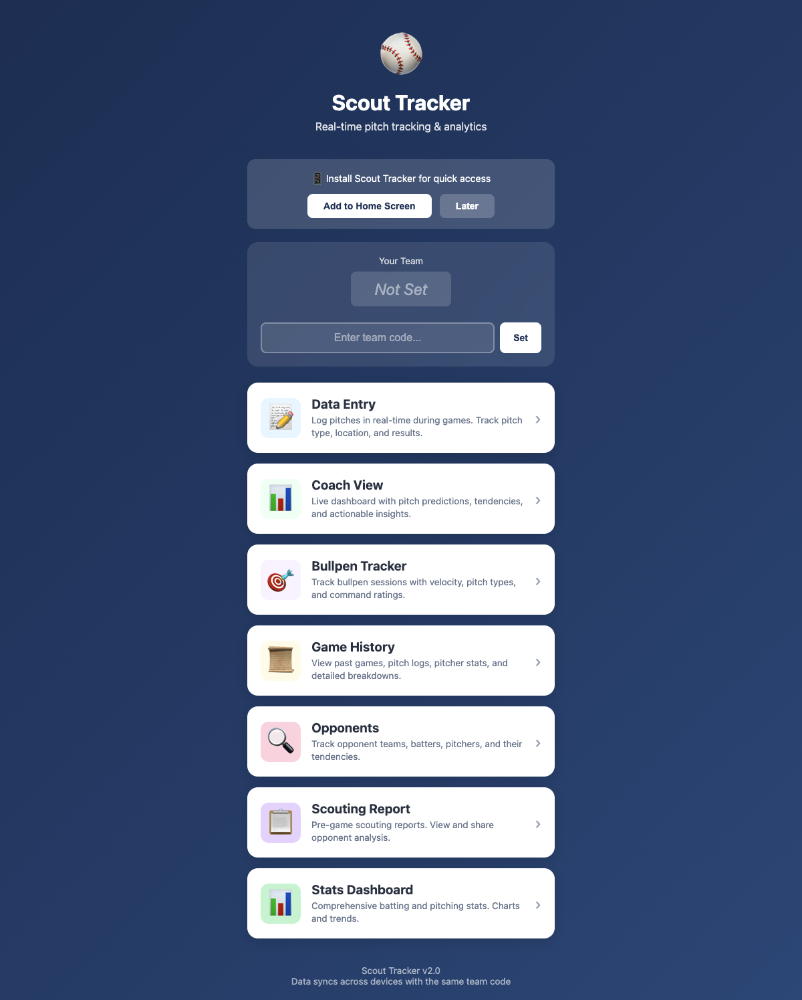

3. **Share the Code** with your coaches and assistants so everyone's data syncs together

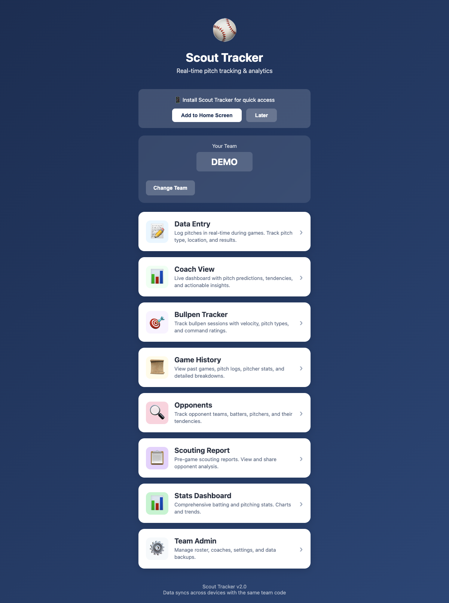

### Add to Home Screen (Recommended)

For quick access on game day:

**iOS (iPhone/iPad):**
1. Open Scout Tracker in Safari
2. Tap the Share button (square with arrow)
3. Scroll down and tap "Add to Home Screen"
4. Name it "Scout Tracker" and tap Add

**Android:**
1. Open Scout Tracker in Chrome
2. Tap the menu (three dots)
3. Tap "Add to Home Screen"

The app will now appear on your home screen like a native app!

---

## Data Entry (Game Tracking)

The Data Entry screen is where you'll spend most of your time during games. It's designed for quick, one-handed operation.

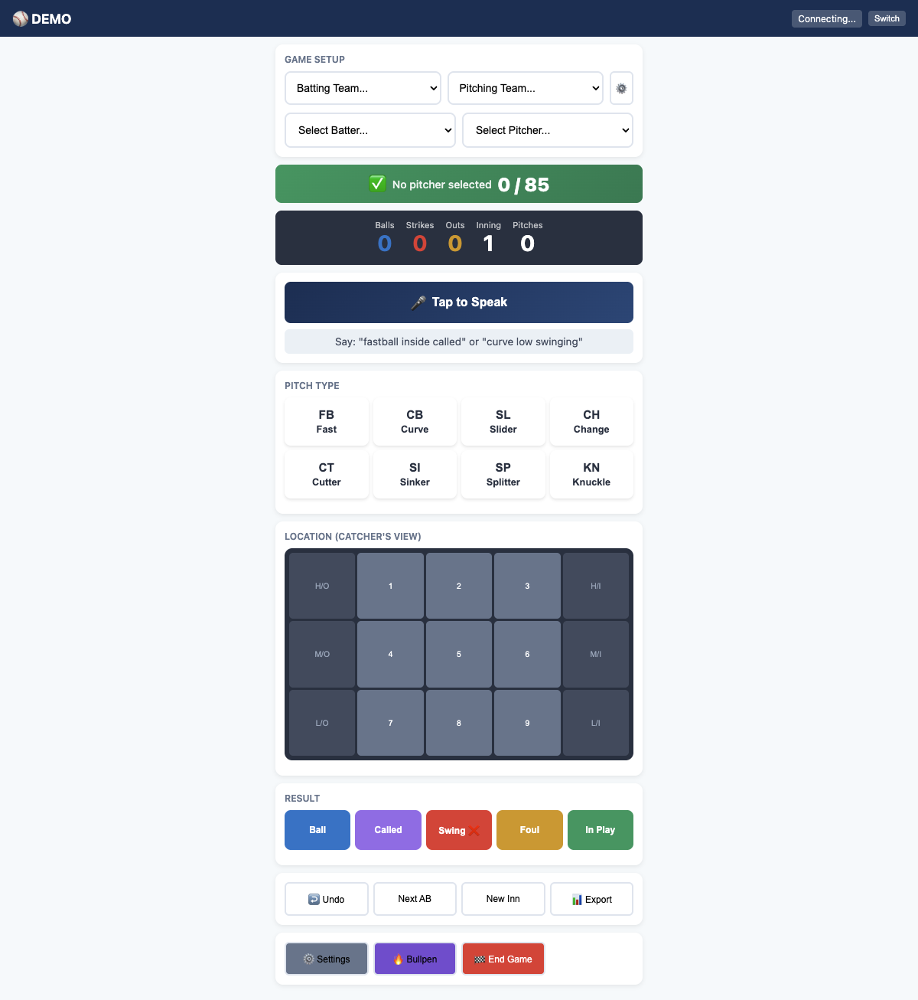

### Game Setup

1. **Select Teams** - Choose the batting and pitching teams from the dropdowns
2. **Select Players** - Pick the current batter and pitcher
3. **Click ⚙️** to add or edit teams with full rosters

### Pitch Count Monitor

The colored bar at the top shows the current pitcher's count:
- **Green (✅)** - Under the warning threshold
- **Yellow (⚠️)** - Approaching the limit
- **Red (🛑)** - At or over the limit

### Recording Pitches

For each pitch, log three things:

1. **Pitch Type** - FB (Fastball), CB (Curveball), SL (Slider), CH (Changeup), etc.

2. **Location** - Use the 9-zone grid from the catcher's perspective:
   - Zones 1-3: High
   - Zones 4-6: Middle
   - Zones 7-9: Low
   - H/O, M/O, L/O: Outside balls
   - H/I, M/I, L/I: Inside balls

3. **Result** - Ball, Called Strike, Swinging Strike, Foul, or In Play

### Voice Entry

Tap "🎤 Tap to Speak" for hands-free logging:
- Say: *"fastball inside called"*
- Say: *"curve low swinging"*
- Say: *"changeup in play"*

### Quick Actions

- **Undo** - Remove the last pitch if you made a mistake
- **Next AB** - Move to the next at-bat (auto-resets count)
- **New Inn** - Start a new inning
- **Export** - Download game data as CSV

### Managing Teams

Click the ⚙️ button next to team selection to add or edit teams:

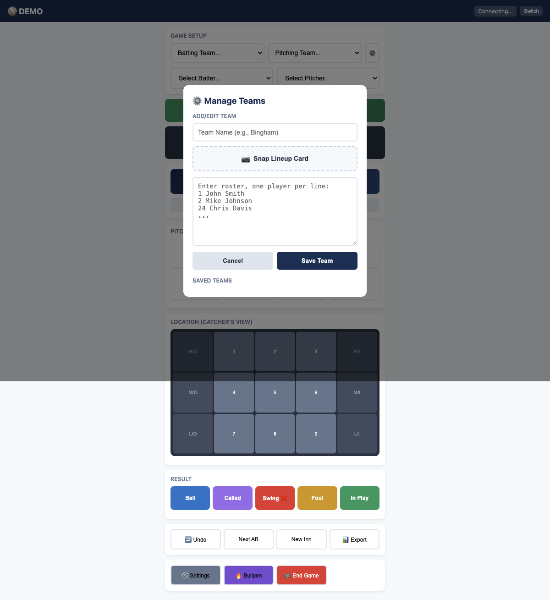

**Adding a team:**
1. Enter the team name
2. Add roster - one player per line with number and name:
   ```
   1 John Smith
   2 Mike Johnson
   24 Chris Davis
   ```
3. Or use **📷 Snap Lineup Card** to photograph a lineup card for automatic roster entry

---

## Coach View (Live Dashboard)

The Coach View provides real-time insights while someone else does data entry. Perfect for the dugout!

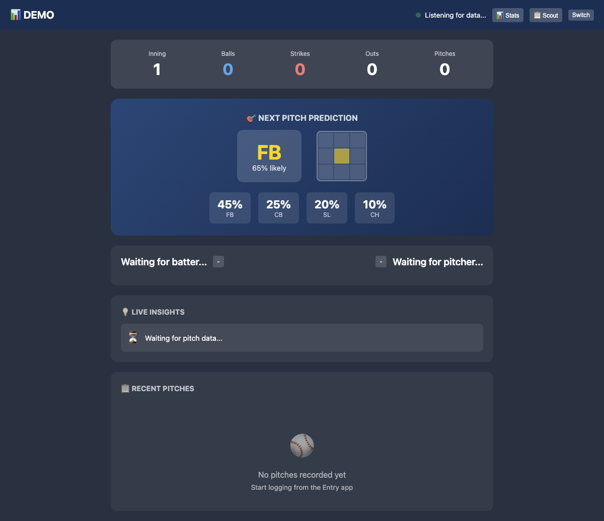

### What You'll See

- **Game State** - Current inning, count, outs, and pitch count
- **Next Pitch Prediction** - AI-powered prediction based on the pitcher's tendencies
- **Pitch Distribution** - Percentage breakdown of pitch types used
- **Live Insights** - Actionable tips like "Pitcher throwing more breaking balls with 2 strikes"
- **Recent Pitches** - Last several pitches with type, location, and result

### Using Coach View During Games

1. Have one person on Data Entry (typically a parent or assistant)
2. Open Coach View on your phone or tablet
3. Data syncs automatically via the team code
4. Check predictions before each pitch to help with defensive positioning

---

## Bullpen Tracker

Track practice sessions and warm-ups separately from games.

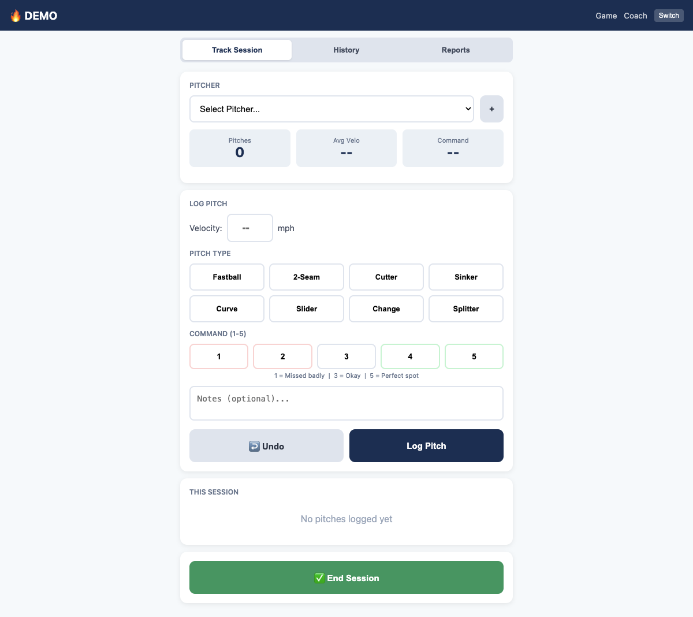

### Starting a Session

1. **Select Pitcher** from the dropdown or add a new one
2. For each pitch:
   - Enter **velocity** (optional)
   - Select **pitch type**
   - Rate **command** (1-5 scale: 1=missed badly, 5=perfect spot)
   - Add **notes** if needed
3. Click **Log Pitch**

### Session Stats

View in real-time:
- Total pitches
- Average velocity
- Average command rating
- Breakdown by pitch type

### Ending Sessions

Click **End Session** to save and review the complete session. Sessions appear in the History tab for future reference.

---

## Game History

Review past games and analyze performance over time.

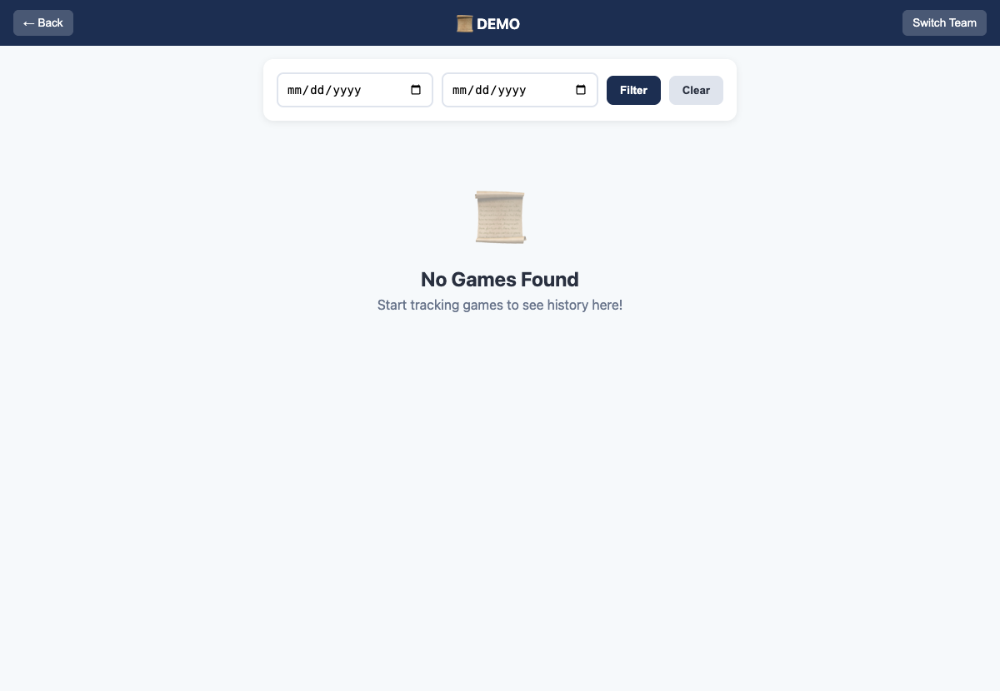

### Finding Games

- Games are listed by date
- Use the **date filters** to narrow results
- Click any game to expand and view details

### Game Details

Expanded view shows:
- Final score and opponent
- Every pitcher used
- Pitch counts per pitcher
- Pitch type breakdown
- Strike percentage

### Exporting Data

You can export individual games or all history for analysis in Excel or other tools.

---

## Opponent Scouting

Build a database of opposing teams and players to prepare for games.

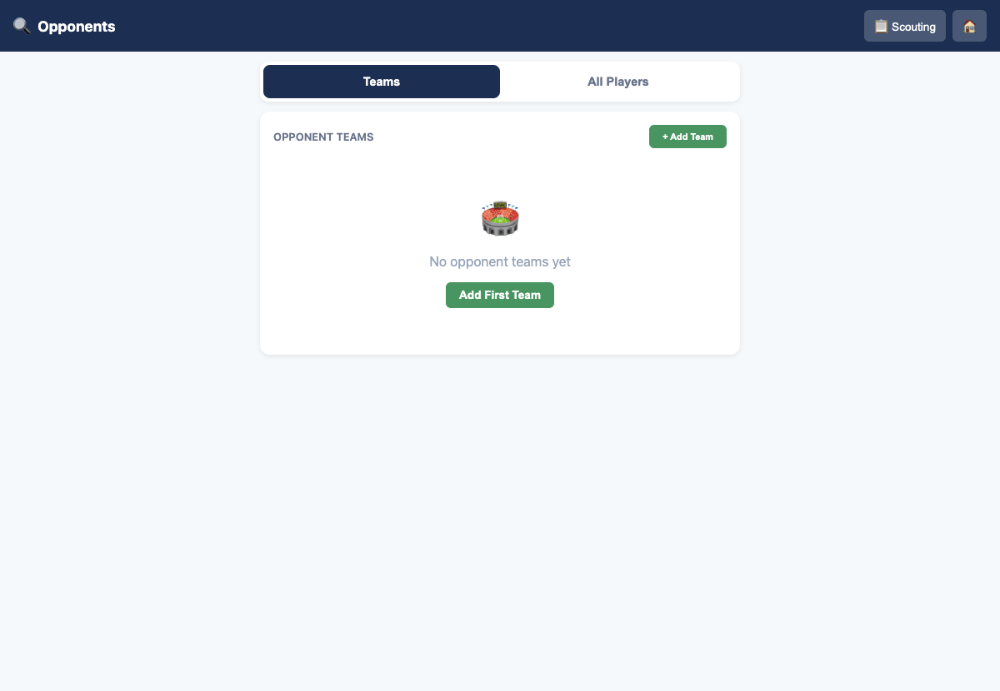

### Adding Opponent Teams

1. Click **+ Add Team**
2. Enter team name
3. Add players to their roster

### Player Tendencies

For each opponent player, track:
- **Batters**: Preferred pitch zones, weaknesses, swing tendencies
- **Pitchers**: Arsenal, favorite counts, patterns

### Using Data in Games

When selecting an opponent as the batting or pitching team, their roster automatically appears in the dropdowns.

---

## Pre-Game Reports

Generate scouting reports before facing an opponent.

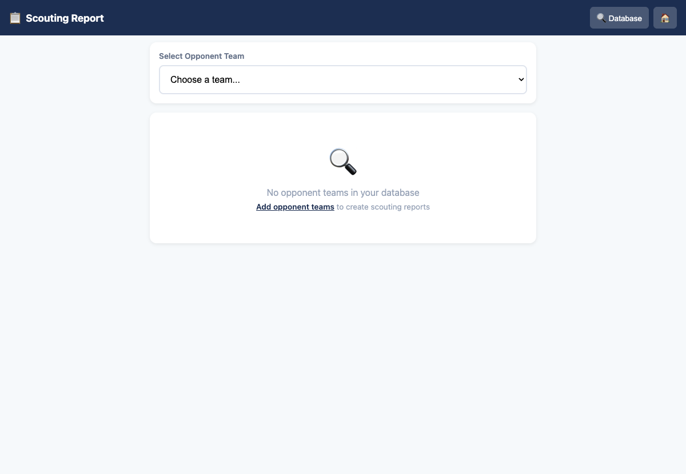

### Creating a Report

1. Select the opponent team
2. The report auto-generates based on your scouting data
3. Share with coaches via the share button

### Report Contents

- Team overview
- Key players to watch
- Pitching staff breakdown
- Batting order tendencies
- Recommended strategies

---

## Stats Dashboard

Comprehensive statistics for your team's performance.

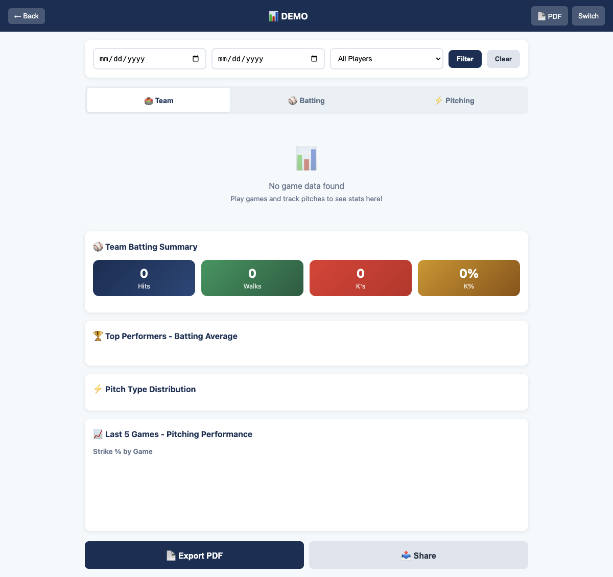

### Tabs

**Team Tab**
- Overall win/loss record
- Team batting average
- Team ERA and WHIP
- Pitch type distribution

**Batting Tab**
- Individual batting averages
- On-base percentage
- Strikeout rates
- Hit distribution by zone

**Pitching Tab**
- ERA by pitcher
- Strike percentage
- Pitch mix breakdown
- Pitch count history

### Filters

- Filter by date range
- Filter by specific player
- View trends over multiple games

### Sharing

- **Export PDF** - Create printable reports
- **Share** - Send stats via text or email

---

## Team Administration

Manage all team settings in one place.

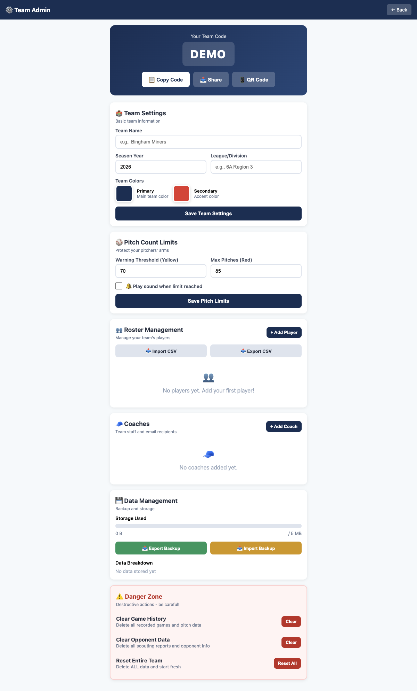

### Team Code

Your unique team code syncs data across all devices. Use the buttons to:
- **Copy Code** - Share with coaches
- **Share** - Send via text/email
- **QR Code** - Generate scannable code

### Team Settings

- **Team Name** - Display name
- **Season Year** - For organization
- **League/Division** - Your competitive level
- **Team Colors** - Customize the app appearance

### Pitch Count Limits

Protect pitchers' arms by setting:
- **Warning Threshold** - When the bar turns yellow (default: 70)
- **Max Pitches** - When the bar turns red (default: 85)
- **Sound Alert** - Optional audio warning

### Roster Management

- **Add Player** - Individual entry
- **Import CSV** - Bulk import from spreadsheet
- **Export CSV** - Backup your roster

### Coaches

Add coaching staff with email addresses to:
- Send automatic game summaries
- Share scouting reports
- Enable multi-device sync

### Data Management

- **Storage Used** - Monitor local storage
- **Export Backup** - Download all data as JSON
- **Import Backup** - Restore from backup file

### Danger Zone

⚠️ **Use with caution!**
- **Clear Game History** - Delete all games (keeps roster)
- **Clear Opponent Data** - Delete scouting database
- **Reset Entire Team** - Factory reset (loses everything)

---

## Tips & Best Practices

### Game Day Setup

1. **Charge devices** before games
2. **Confirm team code** is set on all devices
3. **Test sync** by having someone log a test pitch
4. **Assign roles** - one person on entry, coaches on view

### Data Entry Tips

- Use **voice entry** when your hands are full
- Log pitches **immediately** - don't try to catch up
- Use **Undo** freely - accuracy matters more than speed
- Mark innings **as they change** to keep counts accurate

### Pitch Count Safety

For youth baseball, follow these general guidelines:
- **Ages 9-10**: 50-75 pitches max
- **Ages 11-12**: 75-85 pitches max
- **Ages 13-14**: 75-95 pitches max

Set your limits in Admin settings to match your league rules.

### Building Opponent Data

- Scout opponents **before** you face them when possible
- Update tendencies **after** each game against them
- Focus on **starting pitchers** and **top hitters** first

### Backup Your Data

- **Weekly exports** prevent data loss
- Store backups in cloud storage (Google Drive, iCloud)
- Export before making major roster changes

---

## Troubleshooting

### Data Not Syncing

1. Check internet connection
2. Verify same team code on all devices
3. Refresh the page
4. Check "Connecting..." status in header

### Voice Entry Not Working

1. Allow microphone permission when prompted
2. Speak clearly and wait for processing
3. Use quiet location if possible

### App Running Slowly

1. Clear browser cache
2. Export and clear old game history
3. Close other browser tabs

---

## Need Help?

Scout Tracker is actively developed and improved. For questions, bug reports, or feature requests:

- **GitHub**: [Issues](https://github.com/lamangamatt/scout-tracker/issues)
- **Email**: Check the repository for contact info

---

*Happy tracking! ⚾*
